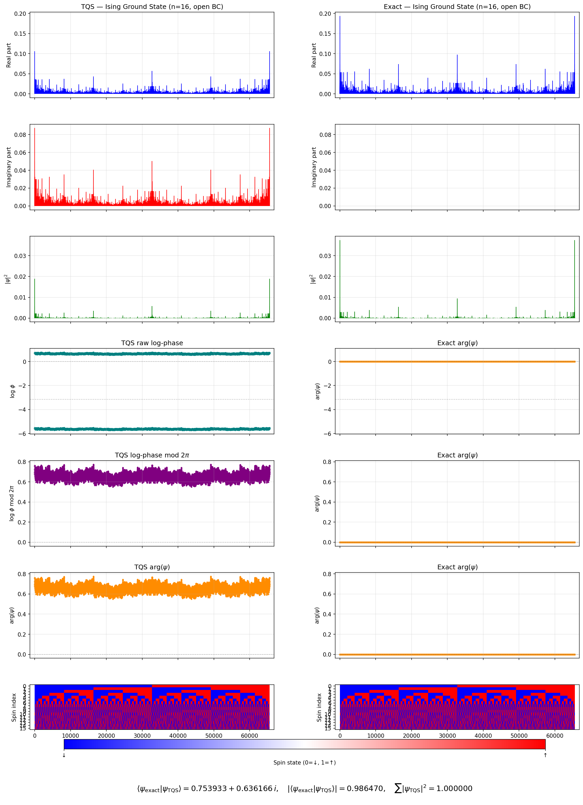
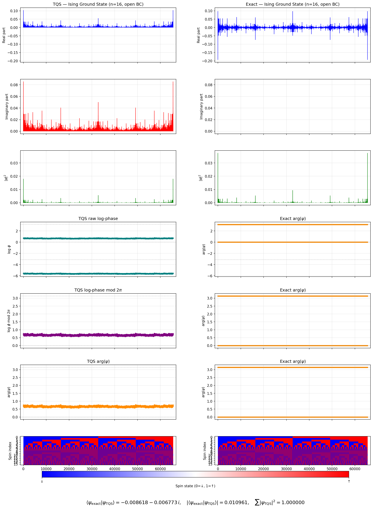
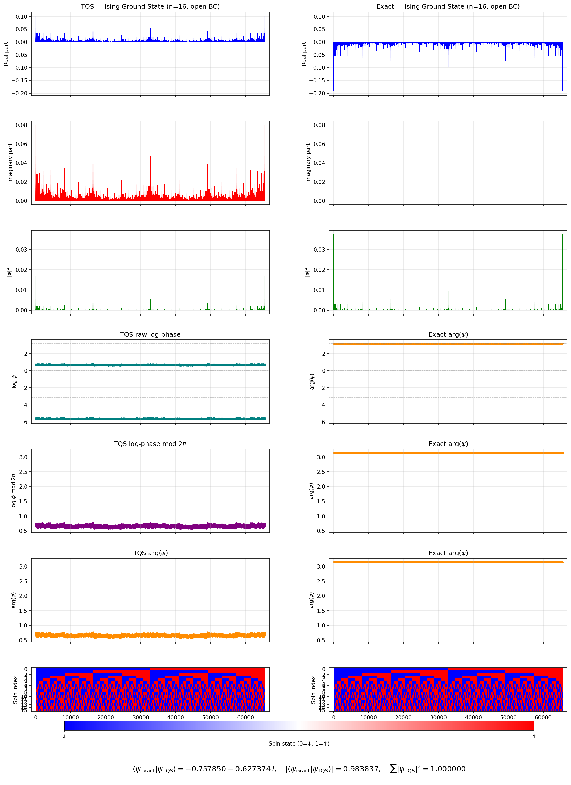
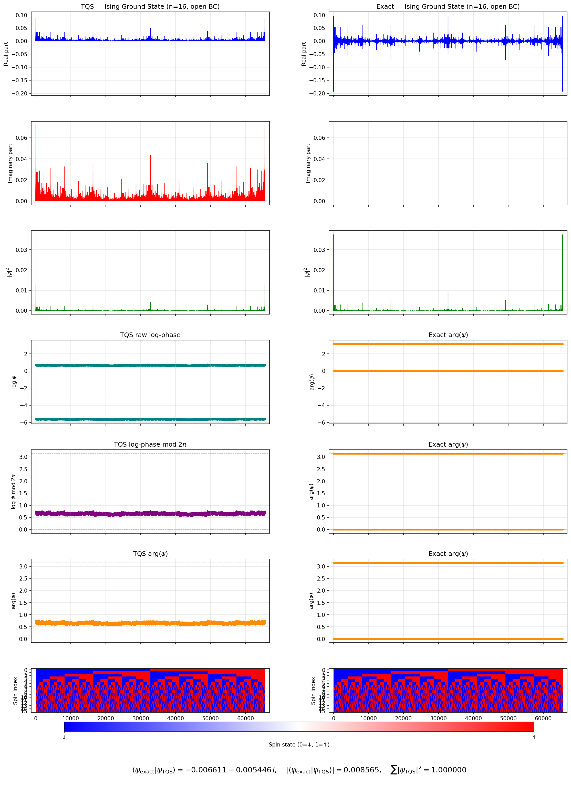
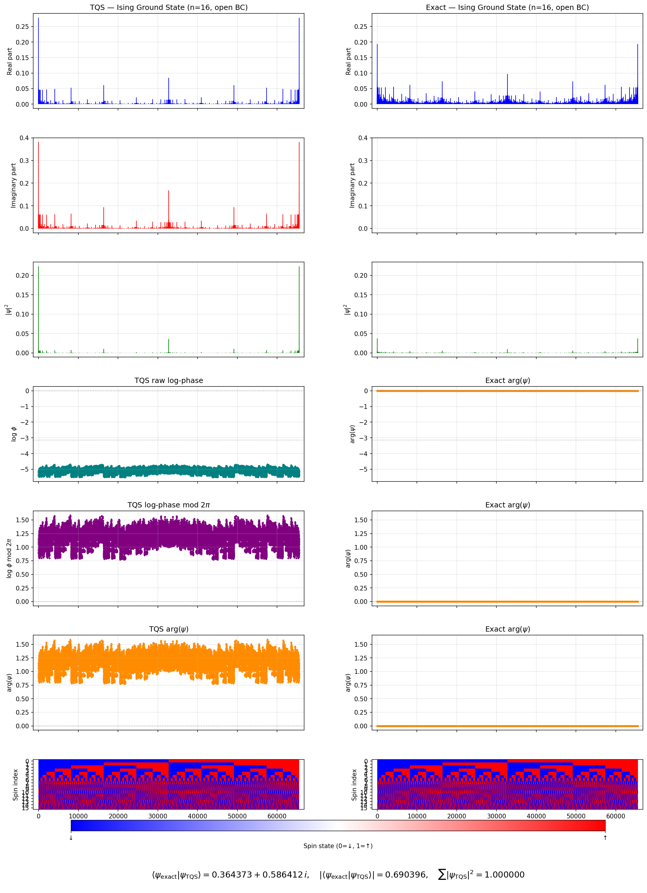
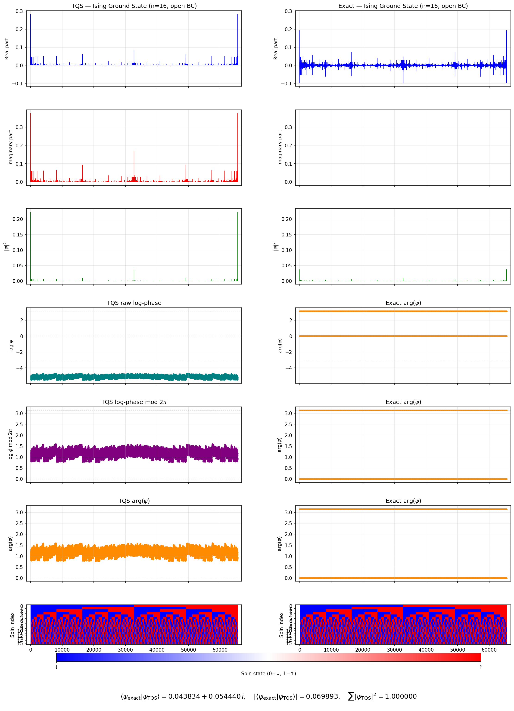
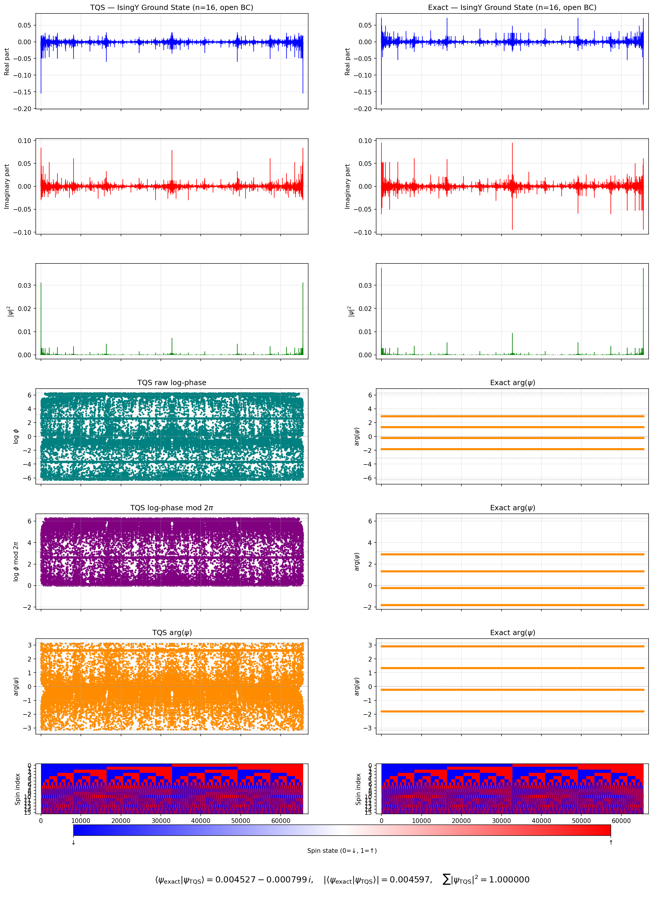
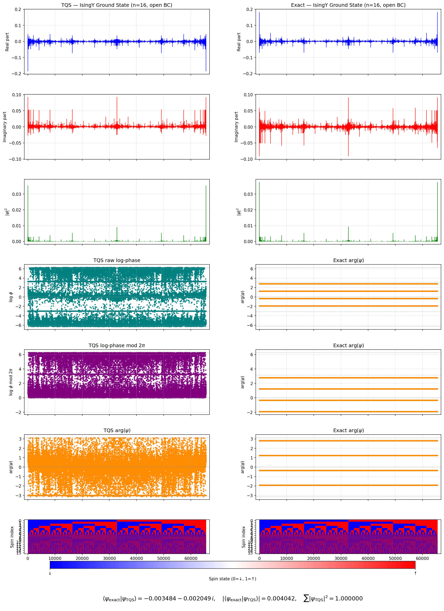

# Comparison Plots

## Plain Ising

### h_inverted

### h_noninverted

### plain_vs_exact_size_16_eval_negated_h

### plain_vs_exact_size_16_eval_nonnegated_h

### train_negated_h_eval_negated_h

### train_negated_h_eval_nonnegated_h

## Along Y Ising

### along_y_vs_exact_size_16_2000_iters

### along_y_vs_exact_size_16_10000_iters

### along_y_vs_exact_size_16_100000_iters

